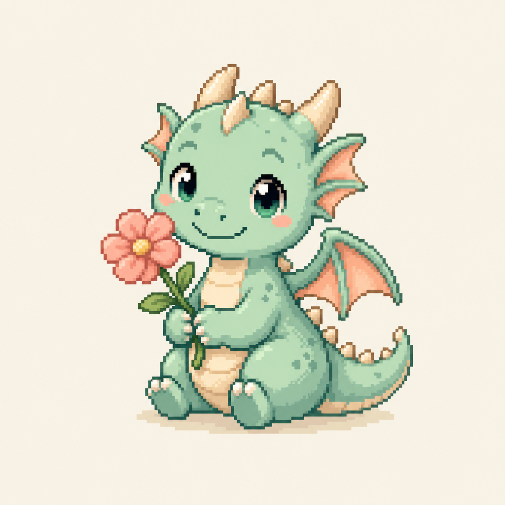

# Pixel Grug — Landing Page

> **Tiny Pixel Stories for Better Days.**
> 매일 한 문장, 한 개의 픽셀 캐릭터, 그리고 작은 미소.

AI가 매일 새로운 픽셀 친구를 만들어 주는 감성 마이크로 저널 앱 **Pixel Grug**의 제품 소개 랜딩페이지입니다. 순수 HTML/CSS/JS로 제작되었으며, 디자인 테마는 **Anthropic Light / Dark Theme**를 따릅니다. 한국어·영어·일본어 3개 언어를 지원합니다.

## 라이브 데모

- **GitHub Pages:** https://segamja.github.io/Gooroom0709/
- **레포지터리:** https://github.com/segamja/Gooroom0709

## 미리보기



## 기술 스택

- **HTML5** — 시맨틱 마크업
- **CSS3** — CSS 커스텀 프로퍼티(디자인 토큰), Grid/Flex 레이아웃, 반응형
- **Vanilla JavaScript** — 프레임워크 없는 순수 인터랙션, i18n, 테마 전환
- **Google Fonts** — Fraunces(세리프), Inter(산세리프), Press Start 2P(픽셀)
- **AI 픽셀아트 에셋** — 생성형 이미지로 캐릭터/오브젝트 제작
- **GitHub Actions** — `main` push 시 GitHub Pages 자동 배포

## 프로젝트 구조

```
Gooroom0709/
├── index.html                    # 12개 섹션 시맨틱 마크업 + data-i18n 속성
├── css/
│   └── styles.css                # Light/Dark 디자인 토큰 + 전체 스타일 + 반응형
├── js/
│   ├── i18n.js                   # ko / en / ja 번역 사전
│   └── main.js                   # i18n·테마 전환, 모바일 메뉴, Daily Pixel 데모
├── .github/
│   └── workflows/
│       └── deploy-pages.yml      # GitHub Pages 자동 배포
├── assets/                       # AI 생성 픽셀아트 이미지 (8종)
│   ├── hero-dragon.png
│   ├── char-fox.png
│   ├── char-spacecat.png
│   ├── char-robot.png
│   ├── char-slime.png
│   ├── char-cloudwhale.png
│   ├── obj-nature.png
│   └── obj-items.png
├── ref/                          # 제품 기획 스펙 문서
└── README.md
```

## 디자인 (Anthropic Light / Dark Theme)

CSS 커스텀 프로퍼티(`:root`, `[data-theme="dark"]`)로 디자인 토큰을 정의했습니다.

| 항목 | Light | Dark |
| --- | --- | --- |
| 배경 | 웜 아이보리 `#F0EEE6` | 웜 다크 `#141310` |
| 카드 | `#FAF9F5` | `#1F1E1A` |
| 텍스트 | 잉크 `#1A1915` | `#F4F1E9` |
| 액센트 | 클레이·코랄 `#CC785C` | `#D4896A` |
| 폰트 | 헤딩 Fraunces · 본문 Inter · 강조 Press Start 2P | 동일 |
| 스타일 | 넉넉한 여백, 소프트 라운드, 미묘한 그림자 | 동일 |

네비게이션 우측 **🌙 / ☀️** 버튼으로 라이트·다크 테마를 전환할 수 있으며, 선택값은 `localStorage`(`pixel-grug-theme`)에 저장됩니다. 첫 방문 시 기본값은 **라이트**입니다.

## 다국어 지원 (i18n)

한국어(ko), 영어(en), 일본어(ja) 3개 언어를 지원합니다.

- **번역 데이터:** `js/i18n.js` — 106개 키 (nav, 12개 섹션, Daily Pixel, 접근성 라벨)
- **마크업:** `data-i18n`, `data-i18n-html`, `data-i18n-attr` 속성으로 DOM 연동
- **UI:** 네비게이션 **KO | EN | JA** 버튼
- **저장:** `localStorage`(`pixel-grug-lang`) — 첫 방문 시 기본값 **한국어**
- **동적 갱신:** `<title>`, `<meta description>`, Daily Pixel 캐릭터 이름·명언·alt 텍스트

## 주요 섹션

1. **고정 네비게이션** — 스크롤 시 배경/그림자 변화, 언어·테마 컨트롤
2. **히어로** — 인터랙티브 "오늘의 픽셀" 카드 + CTA
3. **앱 소개** — 인용 블록 + 3단계 루틴
4. **핵심 컨셉** — "AI가 매일 새로운 픽셀 친구를 만들어 준다" (다크 대비 섹션)
5. **주요 기능 6종** — Daily Pixel / Tiny Wisdom / Pixel Collection / AI Variation / Widget / Share Card
6. **AI 픽셀 갤러리** — Character / Object / Nature / Emotion
7. **디자인 철학** — "하루 10초, 그것이면 충분합니다"
8. **타겟 사용자** — 레퍼런스 앱 태그 포함 4종
9. **차별화 포인트** — 기존 명언 앱 vs Pixel Grug 대비
10. **기술 스택** — Front-end / AI / Backend
11. **장기 비전** — Duolingo 인용 + 최종 CTA
12. **푸터**

## 인터랙션 (JavaScript)

- **다국어 전환** — `applyLocale()`로 106개 번역 키 일괄 적용, Daily Pixel 데모 연동
- **다크 테마 전환** — `applyTheme()` + `[data-theme="dark"]` CSS 변수 오버라이드
- **모바일 햄버거 메뉴** — 토글 + 접근성(`aria-expanded`, `aria-label`) 속성
- **스크롤 리빌** — `IntersectionObserver` 기반 페이드/슬라이드 등장
- **네비 스크롤 상태** — 스크롤 위치에 따른 배경/그림자 전환
- **Daily Pixel 데모** — "다른 친구 만나기" 버튼으로 6종 캐릭터/문장 순환 전환 (이미지 프리로드 포함)

## 접근성 / 반응형

- 모바일 우선 반응형 (브레이크포인트 720 / 960px)
- 이미지 `alt` 텍스트, 시맨틱 태그 사용
- 언어·테마 버튼 터치 영역 44px 이상 확보
- `prefers-reduced-motion` 대응으로 모션 최소화 옵션 지원

## 실행 방법

정적 파일이므로 `index.html`을 브라우저에서 바로 열거나, 로컬 서버로 실행할 수 있습니다.

```bash
# 프로젝트 루트에서 (macOS / Linux)
python3 -m http.server 8123

# Windows
py -m http.server 8123

# 브라우저에서 http://localhost:8123 접속
```

## 배포 (GitHub Pages)

`main` 브랜치에 push하면 GitHub Actions가 `gh-pages` 브랜치를 갱신하고 사이트가 자동 배포됩니다.

- **워크플로:** `.github/workflows/deploy-pages.yml`
- **배포 URL:** https://segamja.github.io/Gooroom0709/

## 개발 과정 및 오류 수정 사항

작업 중 발견하여 수정한 주요 이슈입니다.

### 이번 작업 (다국어 · 다크 테마 · GitHub Pages)

- **다국어(i18n) 지원 추가**
  - 한국어·영어·일본어 3개 locale, `js/i18n.js` 번역 사전 분리
  - `data-i18n` 기반 DOM 갱신, Daily Pixel 데모·메타 태그·aria-label 연동
  - 첫 방문 기본값: 한국어 / `localStorage` 저장값 우선

- **다크 테마 추가**
  - `[data-theme="dark"]` CSS 변수 오버라이드 (Anthropic 톤 웜 다크)
  - nav·concept·vision·share-card 등 하드코딩 색상을 CSS 변수로 통일
  - 네비게이션 🌙/☀️ 토글, 첫 방문 기본값: 라이트

- **GitHub Pages 404 오류 수정**
  - 증상: `https://segamja.github.io/Gooroom0709/` 접속 시 404
  - 원인: GitHub Actions(`deploy-pages`) 워크플로가 `Queued` 상태로 멈춰 Pages 배포가 완료되지 않음
  - 해결: `gh-pages` 브랜치를 직접 생성·푸시하고, 워크플로를 `peaceiris/actions-gh-pages` 기반으로 변경하여 `main` push 시 `gh-pages` 자동 갱신

### 초기 작업 (반응형 · 로컬 실행)

- **모바일 히어로 카드 가로 오버플로우 수정**
  - 증상: 모바일 뷰에서 "오늘의 픽셀" 카드(고정 `max-width: 360px`)가 컨테이너 가용 폭(약 342px)보다 넓어, CSS Grid 트랙이 확장되면서 카드 우측이 뷰포트 밖으로 잘림.
  - 원인: Grid 아이템의 자동 최소 크기(`min-width: auto`)가 카드의 고정 폭을 따라가며 트랙이 컨테이너를 초과.
  - 해결: 모바일 브레이크포인트에서 `.hero__visual { min-width: 0 }`, `.daily-card { max-width: 100% }`를 적용하여 카드가 컨테이너 안에 맞도록 수정.

- **모바일 타이포/패딩 정리**
  - 증상: 인용문/카드 텍스트가 뷰포트 우측에 과도하게 붙음.
  - 해결: 모바일에서 히어로 타이틀·인용문 폰트 크기와 카드 패딩을 축소하여 여백을 확보.

- **로컬 서버 실행 시 샌드박스 권한 이슈**
  - 증상: 정적 서버 기동/스크린샷 캡처 명령이 샌드박스 제한으로 실패.
  - 해결: 필요한 권한으로 재실행하여 렌더링을 검증(데스크톱/모바일 스크린샷 확인, 모든 리소스 `200` 응답).

## 라이선스

이 프로젝트는 학습/데모 목적으로 제작되었습니다.
